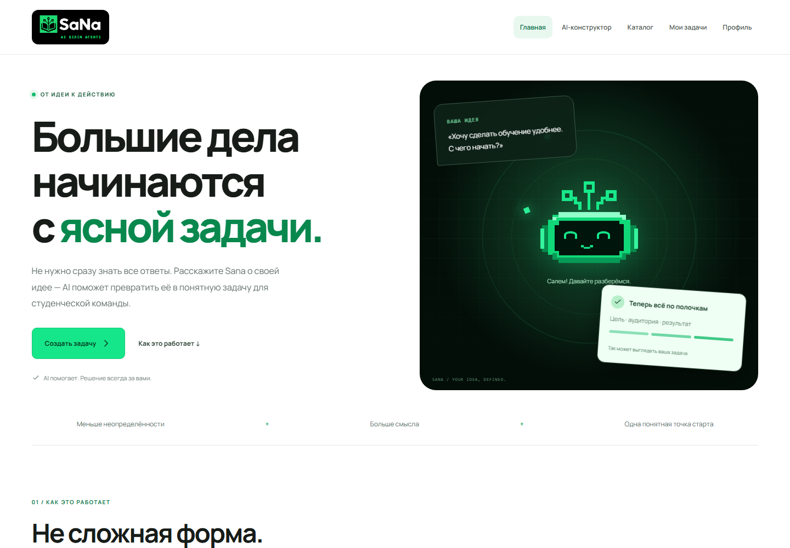
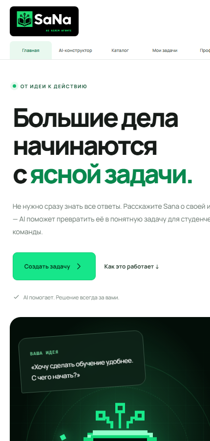
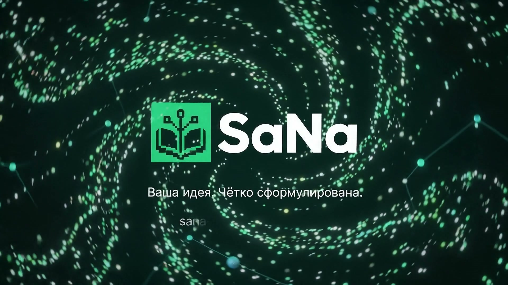
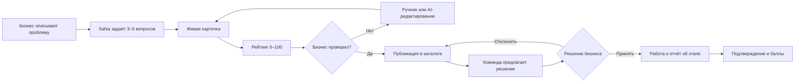
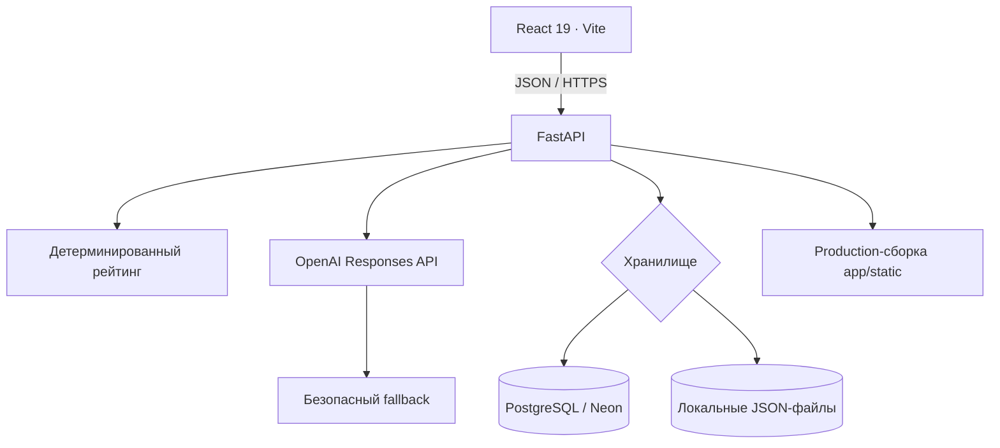

# SaNa — AI-конструктор практических задач

<p align="center">
  <strong>От неструктурированной идеи бизнеса — к проверяемой задаче для студенческой команды.</strong>
</p>

<p align="center">
  <a href="https://sana-hackalem.vercel.app"><strong>Открыть работающий сайт</strong></a>
  ·
  <a href="https://github.com/BAITC-Hacks/hack-2036a781-sana">GitHub</a>
  ·
  <a href="#как-проверить-за-7-минут">Сценарий проверки</a>
</p>

<p align="center">
  
  
  
  
  
</p>



<details>
  <summary><strong>Посмотреть мобильную версию</strong></summary>
  <p align="center">
    
  </p>
</details>

## Видео проекта

<p align="center">
  <a href="docs/media/sana-platform-animation.mp4">
    
  </a>
</p>

<p align="center">
  <a href="docs/media/sana-platform-animation.mp4"><strong>▶ Открыть короткое Full HD видео SaNa</strong></a>
</p>

## Коротко: что это за продукт

SaNa — рабочий веб-MVP по кейсу HackAlem AI о геймификации практических заданий и качестве бизнес-задач. Он соединяет две стороны:

- **бизнес** формулирует реальную проблему, уточняет её вместе с AI, проверяет карточку и вручную публикует задачу;
- **студенческие команды** видят открытый каталог, выбирают подходящую задачу и отправляют идею решения;
- **бизнес сам принимает решение**, с какой командой работать — AI ничего не выбирает автоматически.

Главная ценность продукта: человеку не нужно заранее знать, как правильно составлять техническое задание. Достаточно описать проблему обычными словами. SaNa найдёт пробелы, задаст уточняющие вопросы, соберёт карточку и покажет прозрачный рейтинг готовности.

> AI помогает формулировать. Факты подтверждает пользователь. Публикация и выбор команды всегда остаются за человеком.

## Проблема и решение

| Проблема | Как решает SaNa |
| --- | --- |
| Бизнес описывает запрос слишком общо | AI задаёт 3–5 контекстных вопросов о результате, данных, пользователях, критериях и ограничениях |
| В задаче появляются неподтверждённые догадки | Карточка собирается только из текста и ответов пользователя; неизвестные поля остаются пустыми |
| Непонятно, готова ли задача для команды | Детерминированный рейтинг 0–100 объясняет каждый балл и показывает, чего не хватает |
| Исправления приходится вносить через длинную форму | В живой карточке можно нажать на блок или выделить текст и дать AI точную команду |
| Слабые задачи исчезают из отбора | Низкий рейтинг не скрывает задачу: весь каталог остаётся открытым |
| Алгоритм может выбрать команду непрозрачно | Команды только предлагают решения, а бизнес принимает или отклоняет их вручную |
| Результаты сложно подтвердить | Команда прикладывает ссылку на результат, баллы начисляются только после подтверждения бизнеса |

## Что уже работает

### Для бизнеса

- AI-диалог с минимум тремя уточняющими вопросами;
- три примерных варианта ответа на каждый вопрос;
- честный индикатор этапов обработки, пока AI отвечает;
- живая карточка рядом с чатом и возможность свернуть её;
- переключение между визуальной карточкой и обычными полями;
- редактирование блока мышкой или выделением конкретного текста;
- AI-команды вида «сократи», «сделай понятнее», «добавь срок 4 недели»;
- предварительный просмотр AI-изменения перед кнопкой «Применить»;
- автоматический пересчёт рейтинга после изменения полей;
- только ручная публикация;
- повторное редактирование уже опубликованной задачи;
- просмотр, принятие и отклонение предложений команд;
- подтверждение результата этапа и начисление баллов команде;
- профиль бизнеса и перенос защищённого кода доступа на другое устройство.

### Для студенческой команды

- профиль с интересами, навыками и технологиями;
- открытый каталог всех опубликованных задач;
- фильтры по теме и уровню готовности, сортировка по рейтингу или дате;
- рекомендации по совпадению с профилем без скрытия остальных задач;
- подробная карточка с условиями и всеми подсказками рейтинга;
- понятная форма предложения: идея, план, срок, ссылка на прототип;
- история своих откликов и отправка результата этапа;
- таблица подтверждённого прогресса.

## Пользовательский путь



## Рейтинг готовности

Рейтинг оценивает **полноту конкретной задачи**, а не компанию и не качество идеи. Формула полностью детерминирована: AI не назначает баллы.

| Показатель | Поля карточки | Баллы |
| --- | --- | ---: |
| Контекст и потребность | `context`, `need` | 20 |
| Данные и материалы | `data_materials` | 20 |
| Ожидаемый результат | `expected_result` | 15 |
| Критерии успеха | `success_criteria` | 15 |
| Ограничения | `constraints` | 10 |
| Пользователи | `users` | 10 |
| Связь с бизнесом | `contact`, `interaction_format` | 10 |
| **Всего** |  | **100** |

Поле считается заполненным при наличии не менее 15 символов после удаления пробелов. Если показатель состоит из двух полей, одно заполненное поле даёт половину его баллов.

| Баллы | Уровень |
| ---: | --- |
| 0–39 | Нужны уточнения |
| 40–69 | Рабочая |
| 70–89 | Готовая |
| 90–100 | Приоритетная |

Низкий балл влияет только на метку и позицию при сортировке. Он **не блокирует публикацию и не запрещает отклик**.

## Архитектура



### Как AI работает с данными

1. `/api/analyze` получает черновик, тему и язык.
2. Модель возвращает строго типизированный JSON с 3–5 вопросами и тремя вариантами ответа для каждого.
3. `/api/build-card` получает черновик и ответы.
4. Каждое AI-поле содержит точную цитату-доказательство из пользовательского ввода. Сервер принимает поле только при совпадении с исходным текстом.
5. `/api/edit-card-field` изменяет только выбранное поле и только после отдельной команды пользователя.
6. Перед применением пользователь видит предложенный текст и подтверждает изменение вручную.
7. Если ключ отсутствует, сеть недоступна или ответ не прошёл схему, включается локальный fallback.

Промпты находятся в [`core/prompts.py`](core/prompts.py), AI-логика — в [`core/ai.py`](core/ai.py), контракт — в [`docs/CONTRACT.md`](docs/CONTRACT.md).

## Технологии

| Слой | Технологии | Назначение |
| --- | --- | --- |
| Frontend | React 19, Vite, CSS | SPA, AI-чат, живая карточка, каталог, профили |
| Backend | Python 3.11+, FastAPI, Uvicorn | API, валидация, права доступа, бизнес-логика |
| AI | OpenAI Python SDK, Responses API, Pydantic-схемы | Вопросы, сборка и точечное редактирование карточки |
| Данные | PostgreSQL/Neon или локальный JSON | Задачи, команды, предложения, этапы |
| Проверки | pytest, httpx | API, рейтинг, AI fallback и полный пользовательский сценарий |
| Деплой | Vercel | Публичная production-версия |

## Быстрый запуск

### Требования

- Python **3.11+**;
- Node.js **20+** и npm;
- OpenAI API key — необязателен: без него работает fallback;
- PostgreSQL/Neon — необязателен: без него данные сохраняются локально.

### Windows PowerShell

```powershell
git clone https://github.com/BAITC-Hacks/hack-2036a781-sana.git
cd hack-2036a781-sana

py -3.11 -m venv .venv
.\.venv\Scripts\Activate.ps1
python -m pip install -r requirements.txt

Copy-Item .env.example .env
npm install
npm run build

python -m uvicorn app.main:app --host 127.0.0.1 --port 8000
```

Откройте <http://127.0.0.1:8000>.

### macOS / Linux

```bash
git clone https://github.com/BAITC-Hacks/hack-2036a781-sana.git
cd hack-2036a781-sana

python3 -m venv .venv
source .venv/bin/activate
python -m pip install -r requirements.txt

cp .env.example .env
npm install
npm run build

python -m uvicorn app.main:app --host 127.0.0.1 --port 8000
```

### Разработка интерфейса

В первом терминале запустите backend:

```bash
python -m uvicorn app.main:app --host 127.0.0.1 --port 8000
```

Во втором терминале запустите Vite:

```bash
npm run dev
```

Production-сборка создаётся командой `npm run build` и попадает в `app/static/`.

## Переменные окружения

Скопируйте [`.env.example`](.env.example) в `.env`. Сам `.env` исключён из Git.

| Переменная | Обязательна | Назначение |
| --- | :---: | --- |
| `OPENAI_API_KEY` | Нет | Включает реальные AI-ответы |
| `OPENAI_MODEL` | Нет | Модель; значение проекта по умолчанию — `gpt-6-astra` |
| `OPENAI_REASONING_EFFORT` | Нет | `medium`, `high`, `xhigh` или `max` |
| `OPENAI_MAX_OUTPUT_TOKENS` | Нет | Ограничение токенов ответа, по умолчанию 6000 |
| `REQUEST_TIMEOUT_SECONDS` | Нет | Таймаут запроса к AI, максимум 180 секунд |
| `AI_MODE=fallback` | Нет | Гарантированная демонстрация без внешнего AI |
| `DATABASE_URL` | Нет | PostgreSQL/Neon; без неё используется `.sana-data/` |
| `SANA_DATA_DIR` | Нет | Другой путь для локальных данных |
| `APP_PORT` | Нет | Документированный порт приложения, по умолчанию 8000 |

> Никогда не добавляйте API-ключи и строку подключения к базе в README, исходный код или коммит.

## Как проверить за 7 минут

### 1. Проверить AI-конструктор

1. Откройте [production-сайт](https://sana-hackalem.vercel.app) или локальную версию.
2. Нажмите **«Создать задачу»**.
3. Нажмите **«Загрузить пример»** или напишите: `Нужно сократить время проверки домашних работ по Python`.
4. Отправьте сообщение и ответьте на уточняющие вопросы. Можно выбирать один из трёх предложенных вариантов.
5. Пока AI отвечает, убедитесь, что видны этапы обработки.

### 2. Проверить живую карточку и AI-редактирование

1. После последнего ответа справа появится карточка.
2. Нажмите **«Карточка»** для визуального режима.
3. Нажмите мышкой на блок «Проблема» или выделите часть текста.
4. Напишите команду: `Сделай короче и понятнее`.
5. Нажмите **«Предложить изменение»**.
6. Проверьте результат и только затем нажмите **«Применить»**.
7. Переключитесь в режим **«Поля»**, вручную измените текст и проверьте пересчёт рейтинга.

### 3. Проверить публикацию и каталог

1. Нажмите **«Подтвердить и опубликовать»**.
2. Откройте **«Каталог»**.
3. Проверьте фильтры, сортировку и кнопку **«Открыть задачу»**.
4. Убедитесь, что незаполненные данные явно отмечены, а рейтинг показывает все советы.

### 4. Проверить путь команды

1. Переключитесь на роль **«Команда»**.
2. Нажмите **«Создать команду»** — откроется профиль.
3. Заполните название, интересы, навыки и технологии.
4. Вернитесь в каталог, откройте задачу и нажмите **«Предложить решение»**.
5. Укажите идею, план, срок и тестовую ссылку `https://example.org/prototype`.

### 5. Проверить решение бизнеса

1. Вернитесь к роли **«Бизнес»**.
2. Откройте **«Мои задачи»**.
3. Примите или отклоните предложение вручную.
4. Для принятой команды отправьте результат этапа, затем подтвердите его бизнесом.
5. Проверьте начисление 10 баллов в таблице прогресса.

### Надёжная демонстрация без интернета

Перед запуском установите в `.env`:

```dotenv
AI_MODE=fallback
```

В этом режиме полный сценарий доступен без OpenAI: используются локальные вопросы, варианты ответов и безопасная сборка карточки из введённых фактов.

## Автоматические проверки

```bash
python -m pytest -q
```

Ожидаемый результат:

```text
27 passed
```

Дополнительные проверки:

```bash
npm run build
curl http://127.0.0.1:8000/api/health
```

Ожидаемый health-check при Neon/PostgreSQL:

```json
{"status":"ok","storage":"postgresql"}
```

## Основные API-методы

| Метод | Endpoint | Что проверяет |
| --- | --- | --- |
| `GET` | `/api/health` | Состояние сервера и тип хранилища |
| `POST` | `/api/analyze` | Анализ черновика и уточняющие вопросы |
| `POST` | `/api/build-card` | Сборка карточки только из пользовательских фактов |
| `POST` | `/api/edit-card-field` | AI-редактирование выбранного поля |
| `POST` | `/api/rating` | Детерминированный пересчёт рейтинга |
| `GET/POST` | `/api/tasks` | Каталог и публикация задач |
| `PUT` | `/api/tasks/{id}` | Изменение своей задачи по коду владельца |
| `GET/POST` | `/api/tasks/{id}/proposals` | Предложения команд |
| `POST` | `/api/proposals/{id}/decision` | Ручное решение бизнеса |
| `POST` | `/api/proposals/{id}/progress` | Отчёт команды об этапе |
| `POST` | `/api/progress/{id}/decision` | Подтверждение этапа бизнесом |

Подробные структуры запросов и ответов: [`docs/CONTRACT.md`](docs/CONTRACT.md).

## Структура репозитория

```text
Hackalem/
├── app/
│   ├── main.py                 # FastAPI endpoints и проверка доступа
│   └── static/                 # production-сборка React
├── core/
│   ├── ai.py                   # OpenAI, схемы и fallback
│   ├── prompts.py              # системные промпты
│   ├── rating.py               # формула рейтинга
│   └── store.py                # Neon/PostgreSQL и локальное хранилище
├── frontend/
│   ├── src/App.jsx             # интерфейс и пользовательские сценарии
│   └── src/styles.css          # адаптивный дизайн SaNa
├── tests/                      # 27 автоматических проверок
├── docs/                       # контракт, аудит кейса и документация
├── data/                       # синтетические примеры, не production-данные
├── api/index.py                # входная точка Vercel
├── requirements.txt
├── package.json
└── vercel.json
```

## Хранение и безопасность

- секреты читаются только из переменных окружения;
- `.env`, `.sana-data/` и локальные данные исключены из Git;
- сервер валидирует длину и тип всех входных полей;
- внешние ссылки принимаются только с безопасной схемой `http/https`;
- коды владельца и команды хранятся на сервере только в виде хеша;
- изменение задач, решений и прогресса требует соответствующий код доступа;
- OpenAI-запросы выполняются с `store=False`;
- неизвестные факты не должны автоматически попадать в карточку;
- AI-изменение не применяется без явного нажатия пользователя.

## Деплой

Рабочая версия: **<https://sana-hackalem.vercel.app>**

Vercel выполняет `npm run build`, публикует React-сборку из `app/static/` и направляет API-запросы в `api/index.py`. Для production необходимо задать `OPENAI_API_KEY` и `DATABASE_URL` в переменных окружения проекта Vercel.

## Ограничения MVP

- нет полноценной регистрации: права восстанавливаются через личный код доступа;
- при потере кода и очистке браузера доступ автоматически восстановить нельзя;
- локальная версия доступна другим пользователям только пока запущен сервер;
- AI зависит от доступности провайдера, поэтому предусмотрен fallback;
- правила начисления 10 баллов за подтверждённый этап — механика MVP;
- перед реальным использованием нужно добавить мониторинг, резервные копии базы, rate limiting и полноценную авторизацию.

## Полезные документы

- [Контракт API и AI](docs/CONTRACT.md)
- [Аудит соответствия кейсу](docs/CASE_AUDIT.md)
- [Чек-лист проверки](docs/CHECKLIST.md)
- [Быстрый старт](docs/START.md)
- [Индекс документации](docs/INDEX.md)

---

<p align="center">
  <strong>SaNa — саналы көмекші, сенің білім серігің.</strong><br>
  AI помогает. Решение всегда за вами.
</p>
